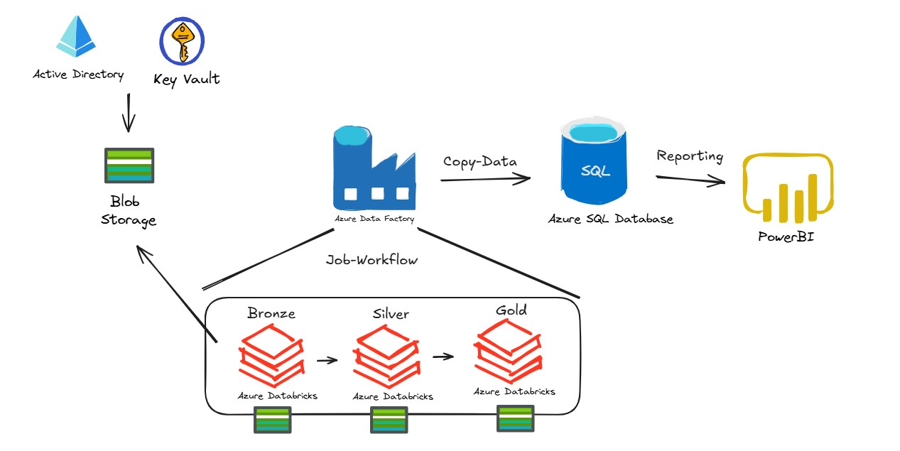

# etl-final pepe

## Diagrama de la Arquitectura (Azure)

## Descripción del Dataset
1. **Data_rcc**: Historial Crediticio
* codmes: año y mes de la observación
* condicion: dias de atraso
* tipo_credito: tipo de credito
* cod_instit_financiera: codigo de la institución financiera otorgante
* saldo: monto de línea o adeudado
* PRODUCTO: tipo de producto, para la descripción cruzar con productos.csv
* RIESGO_DIRECTO: un indicador ordinal del riesgo de la persona
* COD_CLASIFICACION_DEUDOR: un indicador categórico del riesgo de la persona

2. **Data_sunat**: información fiscal
* tipcontribuyente: tipo de contribuyente sunat.
* tippersona: tipo de persona sunat.

3. **Data_product**: Descripción del producto (solo *nombre del producto*)

## Consideraciones de seguridad y buenas prácticas

1. Seguridad de Indentidad y Acceso (IAM)
<table>
  <thead>
    <tr>
      <th>Recomendación</th>
      <th>Detalle</th>
    </tr>
  </thead>
  <tbody>
    <tr>
      <td>🔐 Azure Active Directory (AAD)</td>
      <td>Usar autenticación basada en roles (RBAC) para todos los servicios: Blob, ADF, Databricks, SQL, Power BI.</td>
    </tr>
    <tr>
      <td>👥 Principio de mínimo privilegio</td>
      <td>Asignar solo los roles necesarios (ej. <code>Storage Blob Data Reader</code>, <code>Contributor</code>, etc.).</td>
    </tr>
    <tr>
      <td>👤 Managed Identities</td>
      <td>Evitar secretos explícitos usando identidades administradas (MSI) entre servicios como ADF ↔ SQL ↔ Databricks.</td>
    </tr>
  </tbody>
</table>

2. Protección de Secretos y Claves

<table>
  <thead>
    <tr>
      <th>Recomendación</th>
      <th>Detalle</th>
    </tr>
  </thead>
  <tbody>
    <tr>
      <td>🔑 Azure Key Vault</td>
      <td>Almacenar secretos sensibles: claves de storage, conexiones a SQL, tokens de acceso a APIs.</td>
    </tr>
    <tr>
      <td>🔒 No hardcodear secretos</td>
      <td>Usar referencias a Key Vault desde ADF o Databricks. Evitar que aparezcan en código o pipelines.</td>
    </tr>
  </tbody>
</table>

3. Seguridad del Almacenamiento de Datos

<table>
  <thead>
    <tr>
      <th>Recomendación</th>
      <th>Detalle</th>
    </tr>
  </thead>
  <tbody>
    <tr>
      <td>📦 Blob Storage: acceso restringido</td>
      <td>Desactivar acceso anónimo. Usar SAS tokens con expiración o RBAC.</td>
    </tr>
    <tr>
      <td>🔐 Encryption at rest</td>
      <td>Usar claves administradas por el cliente (CMK) si hay requerimientos regulatorios.</td>
    </tr>
    <tr>
      <td>📤 Encryption in transit</td>
      <td>Usar solo conexiones HTTPS/TLS. Configuración por defecto en la mayoría de servicios Azure.</td>
    </tr>
  </tbody>
</table>

4. Buenas Prácticas en Databricks

<table>
  <thead>
    <tr>
      <th>Recomendación</th>
      <th>Detalle</th>
    </tr>
  </thead>
  <tbody>
    <tr>
      <td>🔥 Control de acceso</td>
      <td>Usar ACLs en notebooks y clusters para limitar acceso de lectura o ejecución.</td>
    </tr>
    <tr>
      <td>📁 Montaje seguro</td>
      <td>Montar almacenamiento usando secretos de Key Vault en vez de claves visibles.</td>
    </tr>
    <tr>
      <td>✅ Revisión de código</td>
      <td>Usar control de versiones (Git) y revisión de código antes de pasar a producción.</td>
    </tr>
  </tbody>
</table>

5. Power BI: Seguridad y Gobierno

<table>
  <thead>
    <tr>
      <th>Recomendación</th>
      <th>Detalle</th>
    </tr>
  </thead>
  <tbody>
    <tr>
      <td>🔐 Row-Level Security (RLS)</td>
      <td>Restringir visualización de datos por usuario o grupo (RLS dinámico).</td>
    </tr>
    <tr>
      <td>📊 Control de Workspaces</td>
      <td>Separar workspaces de desarrollo y producción. Limitar acceso a consumidores.</td>
    </tr>
  </tbody>
</table>

6. Monitoreo y Alertas

<table>
  <thead>
    <tr>
      <th>Recomendación</th>
      <th>Detalle</th>
    </tr>
  </thead>
  <tbody>
    <tr>
      <td>📊 Azure Monitor + Log Analytics</td>
      <td>Habilitar logs de diagnóstico para Blob, SQL, Databricks, ADF.</td>
    </tr>
    <tr>
      <td>🚨 Alertas automáticas</td>
      <td>Configurar alertas por fallos de pipeline, uso anómalo o accesos no autorizados.</td>
    </tr>
  </tbody>
</table>

7. Aislamiento y Seguridad de Red

<table>
  <thead>
    <tr>
      <th>Recomendación</th>
      <th>Detalle</th>
    </tr>
  </thead>
  <tbody>
    <tr>
      <td>🌐 Private Endpoints</td>
      <td>Conectar servicios a través de Azure Private Link, sin salir a internet pública.</td>
    </tr>
    <tr>
      <td>🧱 Firewalls y reglas de IP</td>
      <td>Restringir rangos de IP permitidos para Storage y SQL Database.</td>
    </tr>
  </tbody>
</table>

## Limitaciones y posibles mejoras

* Durante el desarrollo de la solución, se integró el servicio de Azure Key Vault para gestionar y mejorar la seguridad de las llaves (credenciales) entre App-Registration y Databricks, sin embargo, en términos de seguridad, se recomienda implementar las buenas prácticas mencionadas de la sección anterior.
* Utilizar Azure DevOps para implementar la solución en un entorno de producción, CI/CD
* Si lo que buscas es más Análisis de Datos, se recomienda utilizar los servicios de analítica de Azure como Azure Synapse para hacer más robusto la solución en estos temas.